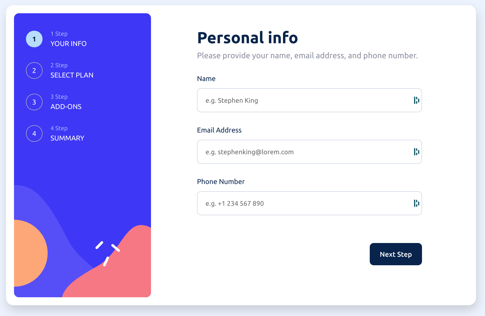
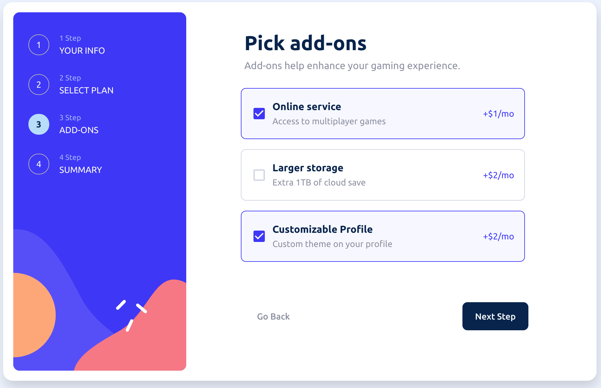

# Multi-Step Form

<div align="center">
  <h3>An interactive and responsive multi-step form</h3>
  <p>Frontend Mentor challenge built with React, TypeScript and Material-UI</p>


</div>

## About The Project

This project is a complete implementation of an interactive multi-step form, developed as a solution to the [Frontend Mentor](https://www.frontendmentor.io) challenge. The application allows users to navigate through different steps of a subscription process, select plans, add-ons, and view a summary before final confirmation.

### Features

- ✅ Navigate through multiple form steps
- ✅ Field validation with custom error messages
- ✅ Go back to previous steps to update selections
- ✅ Complete summary of selections on the final step
- ✅ Toggle between monthly and yearly plans
- ✅ Fully responsive design (mobile and desktop)
- ✅ Hover and focus states for interactive elements
- ✅ Error handling with Error Boundary
- ✅ Unit tests with Jest and React Testing Library

## Screenshots

### Desktop View

<div align="center">

**Step 1: Personal Information**



**Step 2: Plan Selection**


**Step 2: Yearly Plan**


**Step 3: Add-ons**



**Step 4: Summary**


**Final Page**


**Error Validation**


</div>

## Tech Stack

### Core

- **[React 19](https://react.dev/)** - JavaScript library for building user interfaces
- **[TypeScript](https://www.typescriptlang.org/)** - JavaScript superset with static typing
- **[Vite](https://vitejs.dev/)** - Next generation build tool and dev server

### UI/Styling

- **[Material-UI (MUI) v7](https://mui.com/)** - React component library
- **[Emotion](https://emotion.sh/)** - CSS-in-JS for styled components
- **Styled Components** - Custom styling with Theme Provider

### Code Quality

- **[ESLint](https://eslint.org/)** - Linter for identifying problems
- **[Prettier](https://prettier.io/)** - Code formatter
- **[Jest](https://jestjs.io/)** - Testing framework
- **[React Testing Library](https://testing-library.com/)** - React component testing

## Project Structure

```
multi-step-form/
├── src/
│   ├── __tests__/              # Global tests
│   ├── components/             # Reusable components
│   │   ├── Card/              # Card component
│   │   ├── ErrorBoundary/     # Error handling
│   │   └── layout/            # Layout components
│   │       ├── Header/
│   │       ├── Actions/
│   │       └── Navbar/
│   ├── contexts/              # Context API
│   │   ├── FormContext.ts    # Form context
│   │   └── FormProvider.tsx  # Form provider
│   ├── data/                  # Static data
│   │   ├── addOnsData.ts
│   │   ├── plansData.ts
│   │   └── stepsData.ts
│   ├── hooks/                 # Custom hooks
│   │   ├── useForm.tsx
│   │   ├── useIsMobile.tsx
│   │   └── useMultiStepForm.tsx
│   ├── pages/                 # Application pages
│   │   └── MultiStepForm/
│   │       ├── steps/         # Form steps
│   │       ├── MobileForm/
│   │       └── WebForm/
│   ├── styles/                # Global styles and theme
│   │   ├── fonts.css
│   │   ├── theme.ts
│   │   └── index.ts
│   ├── types/                 # TypeScript definitions
│   │   └── types.ts
│   ├── utils/                 # Utility functions
│   │   └── priceUtils.ts
│   ├── App.tsx
│   └── main.tsx
├── public/                    # Static files
├── package.json
├── tsconfig.json
├── vite.config.ts
└── jest.config.js
```

## Getting Started

### Prerequisites

- Node.js (version 16 or higher)
- npm or yarn

### Installation

1. Clone the repository

```bash
git clone <repository-url>
```

2. Navigate to the project folder

```bash
cd multi-step-form
```

3. Install dependencies

```bash
npm install
```

### Available Scripts

#### Development

```bash
npm run dev
```

Starts the development server at [http://localhost:5173](http://localhost:5173)

#### Build

```bash
npm run build
```

Compiles TypeScript and creates optimized production build in the `dist/` folder

#### Preview

```bash
npm run preview
```

Preview the production build locally

#### Testing

```bash
npm test              # Run tests
npm run test:watch    # Run tests in watch mode
npm run test:coverage # Run tests with coverage
```

#### Lint and Formatting

```bash
npm run lint          # Check code issues
npm run lint:fix      # Fix issues automatically
npm run format        # Format code
npm run format:check  # Check formatting
```

## Architecture and Patterns

### State Management

The project uses **Context API** to manage global form state, avoiding prop drilling and centralizing business logic.

### Custom Hooks

- **useMultiStepForm**: Manages navigation between steps
- **useForm**: Manages form state and validation
- **useIsMobile**: Detects if the device is mobile for conditional rendering

### Responsiveness

The application automatically adapts to different screen sizes:

- Mobile: Vertical layout with bottom navigation
- Desktop: Horizontal layout with side navigation

### Validation

Robust validation system that checks:

- Required fields are filled
- Correct email format
- At least one item selected in choice steps

## Deployment

The project can be easily deployed to:

- [Vercel](https://vercel.com/)
- [Netlify](https://www.netlify.com/)
- [GitHub Pages](https://pages.github.com/)

### Deploy to Vercel (Recommended)

```bash
npm install -g vercel
vercel
```

## Future Improvements

- [ ] Backend integration for data persistence
- [ ] Transition animations between steps
- [ ] Dark mode
- [ ] Internationalization (i18n)
- [ ] Payment gateway integration
- [ ] Auto-save progress

## Key Learnings

This project demonstrates:

- Scalable React application architecture
- Complex state management
- TypeScript for type safety
- Unit and integration testing
- Responsive and accessible design
- Frontend development best practices

## License

This project was developed for educational purposes as part of the Frontend Mentor challenge.

## Author

**Gutu Galuppo**

---

<div align="center">
  Built with React, TypeScript and Material-UI
</div>
